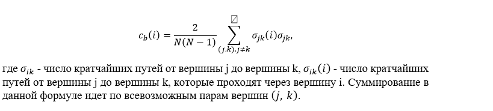
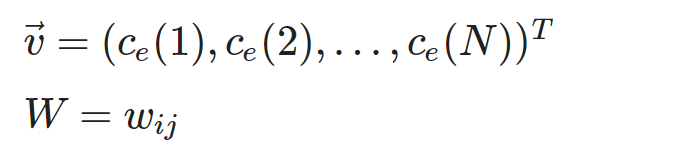
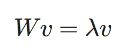

# Центральности
## Центральность по близости **(closeness centrality)**


Данная мера имеет простой физический смысл: чем меньше расстояния от i-ой вершины до остальных j-ых вершин графа (в экстремальном случае _d(ij)_= 1, т. е. вершины i и j связаны ребром), тем меньше будет знаменатель в формуле для c_c (i), и тем больше будет значение самой центральности. 
Важно отметить, что данная мера имеет смысл только для связных графов, так как при наличии изолированных вершин или целых компонент кратчайшие пути до этих объектов будут вырождаться в бесконечность со всеми вытекающими последствиями.

Для вычисления данной центральности воспользуемся процедурой *gds.closeness*.

```
CALL gds.closeness.write('myGraph', { writeProperty: 'closeness_centrality' })
             YIELD centralityDistribution, nodePropertiesWritten
             RETURN centralityDistribution.min AS minimumScore, centralityDistribution.mean AS meanScore, nodePropertiesWritten;
```
Запрос на вывод одногруппников по убыванию центральности по близости
```
match (n:Classmates)
return n.id, n.eigenvector_centrality
order by n.closeness_centrality desc;
```
Резульат:
```
╒═══════════╤══════════════════════╕
│n.id       │n.closeness_centrality│
╞═══════════╪══════════════════════╡
│"212487510"│0.30662523253638774   │
├───────────┼──────────────────────┤
│"236783753"│0.3032054617210005    │
├───────────┼──────────────────────┤
│"256804252"│0.3020160461110568    │
├───────────┼──────────────────────┤
│"461814307"│0.2835962889634416    │
├───────────┼──────────────────────┤
│"54705450" │0.27851772480486353   │
├───────────┼──────────────────────┤
│"444639273"│0.27719629846286886   │
├───────────┼──────────────────────┤
│"383087847"│0.27640265568230055   │
├───────────┼──────────────────────┤
│"146075397"│0.27635666915191387   │
├───────────┼──────────────────────┤
│"184267947"│0.27499449994179015   │
├───────────┼──────────────────────┤
│"75785096" │0.27379825883221964   │
├───────────┼──────────────────────┤
│"381907905"│0.27133358694973286   │
├───────────┼──────────────────────┤
│"143661083"│0.27089651719989305   │
├───────────┼──────────────────────┤
│"232210943"│0.2679237292155988    │
├───────────┼──────────────────────┤
│"315590903"│0.26730362532889573   │
├───────────┼──────────────────────┤
│"531619927"│0.2628814807291931    │
├───────────┼──────────────────────┤
│"139939428"│0.25790639610818245   │
├───────────┼──────────────────────┤
│"146697287"│0.25532321516935486   │
├───────────┼──────────────────────┤
│"194848002"│0.25115677149472465   │
├───────────┼──────────────────────┤
│"260727197"│0.25037562530328117   │
├───────────┼──────────────────────┤
│"112370537"│0.24405786852883113   │
├───────────┼──────────────────────┤
│"163067034"│0.24304736135411156   │
├───────────┼──────────────────────┤
│"276581495"│0.2413283272764707    │
├───────────┼──────────────────────┤
│"308412461"│0.22722255140781705   │
└───────────┴──────────────────────┘
```
## **Центральность по посредничеству (betweenness centrality)**



Простыми словами, данная мера показывает насколько часто рассматриваемая вершина i является "перевалочным пунктом" при переходах от одной вершины графа до любой другой. Она позволяет достаточно хорошо определять «узкие места» в графе — вершины, входящие в состав ребра или набора рёбер, соединяющих два ярко выраженных кластера.

Для вычисления данной центральности воспользуемся процедурой *gds.betweenness.*

```
CALL gds.betweenness.write('myUndirectedGraph', { writeProperty: 'betweenness' })

yield centralityDistribution, nodePropertiesWritten

RETURN centralityDistribution.min AS minimumScore, centralityDistribution.mean AS meanScore, nodePropertiesWritten;
```

Запрос на вывод одногруппников по убыванию центральности по посредничеству

```
match (n:Classmates)
return n.id, n.betweenness
order by n.betweenness desc;
```
Результат:
```
╒═══════════╤══════════════════╕
│n.id       │n.betweenness     │
╞═══════════╪══════════════════╡
│"212487510"│20181118284.32299 │
├───────────┼──────────────────┤
│"256804252"│17227687408.495247│
├───────────┼──────────────────┤
│"236783753"│15317795821.171371│
├───────────┼──────────────────┤
│"75785096" │9295553197.177456 │
├───────────┼──────────────────┤
│"461814307"│5411040001.617561 │
├───────────┼──────────────────┤
│"54705450" │4847815069.36123  │
├───────────┼──────────────────┤
│"232210943"│3851013050.3766365│
├───────────┼──────────────────┤
│"444639273"│3567435321.589928 │
├───────────┼──────────────────┤
│"315590903"│3446759519.977535 │
├───────────┼──────────────────┤
│"531619927"│3351035271.4290285│
├───────────┼──────────────────┤
│"143661083"│3231617759.6666665│
├───────────┼──────────────────┤
│"184267947"│2897704989.7224145│
├───────────┼──────────────────┤
│"146075397"│2497882421.167846 │
├───────────┼──────────────────┤
│"383087847"│2073248229.7870634│
├───────────┼──────────────────┤
│"139939428"│2034581953.325832 │
├───────────┼──────────────────┤
│"194848002"│1960209444.1923196│
├───────────┼──────────────────┤
│"146697287"│1376312217.2958026│
├───────────┼──────────────────┤
│"381907905"│1212615341.1914675│
├───────────┼──────────────────┤
│"163067034"│903948443.4186544 │
├───────────┼──────────────────┤
│"260727197"│534974511.4944765 │
├───────────┼──────────────────┤
│"308412461"│129435992.87121013│
├───────────┼──────────────────┤
│"112370537"│3621988.2106331843│
├───────────┼──────────────────┤
│"276581495"│375602.415835243  │
└───────────┴──────────────────┘
```
## **Центральность по собственному вектору (eigenvector centrality)**

Эта  мера учитывает "влиятельность" (центральных) ближайших соседей самих по себе. Принцип данной меры можно описать так: "если мои друзья влиятельны, то и я буду более влиятельным".  Формула для вычисления данной меры:

где i — индекс рассматриваемой вершины, w_{ij} — вес ребра (i, j), lambda — некоторый нормировочный коэффициент.

Для вычисления центральности по собственному вектору необходимо преобразовать данную формулу, введя обозначения

где i — индекс рассматриваемой вершины, w_{ij} — вес ребра (i, j), lambda — некоторый нормировочный коэффициент.
где \vec{v} — вектор, состоящий из значений центральностей каждой вершины, W — матрица весов рассматриваемого графа.

Используя введенные обозначения, исходная формула преобразуется к



Для вычисления данной центральности воспользуемся процедурой *gds.eigenvector.*


```
CALL gds.eigenvector.write('myGraph', {
               maxIterations: 20,
               writeProperty: 'eigenvector_centrality'
             })
             YIELD nodePropertiesWritten, ranIterations;

```

Запрос на вывод одногруппников по убыванию центральности по собственному значению

```
match (n:Classmates)
return n.id, n.eigenvector_centrality
order by n.eigenvector_centrality desc;
```
Результат:

```
╒═══════════╤════════════════════════╕
│n.id       │n.eigenvector_centrality│
╞═══════════╪════════════════════════╡
│"256804252"│0.05440755843621142     │
├───────────┼────────────────────────┤
│"236783753"│0.01693874450488004     │
├───────────┼────────────────────────┤
│"75785096" │0.015735205540625793    │
├───────────┼────────────────────────┤
│"212487510"│0.015301592630524318    │
├───────────┼────────────────────────┤
│"315590903"│0.013814076815982382    │
├───────────┼────────────────────────┤
│"54705450" │0.006984461912523504    │
├───────────┼────────────────────────┤
│"461814307"│0.006166589938318626    │
├───────────┼────────────────────────┤
│"531619927"│0.005430053932885739    │
├───────────┼────────────────────────┤
│"146075397"│0.004690090766692613    │
├───────────┼────────────────────────┤
│"184267947"│0.0041528317364250035   │
├───────────┼────────────────────────┤
│"383087847"│0.003977256774724595    │
├───────────┼────────────────────────┤
│"232210943"│0.0026325586471932613   │
├───────────┼────────────────────────┤
│"444639273"│0.0022743776234635184   │
├───────────┼────────────────────────┤
│"194848002"│0.0021078445689545642   │
├───────────┼────────────────────────┤
│"143661083"│0.0019973772610455626   │
├───────────┼────────────────────────┤
│"139939428"│0.0018625915775137612   │
├───────────┼────────────────────────┤
│"381907905"│0.0015373195102619211   │
├───────────┼────────────────────────┤
│"146697287"│0.0010443867866360066   │
├───────────┼────────────────────────┤
│"112370537"│0.0009460243458150667   │
├───────────┼────────────────────────┤
│"276581495"│0.000936483428778983    │
├───────────┼────────────────────────┤
│"260727197"│0.0008867608123980089   │
├───────────┼────────────────────────┤
│"163067034"│0.00039329549356265184  │
├───────────┼────────────────────────┤
│"308412461"│0.000012772938126051037 │
└───────────┴────────────────────────┘
```
